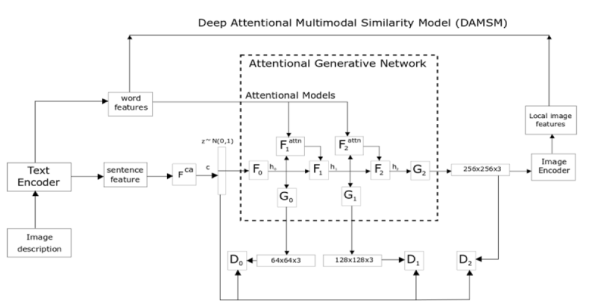
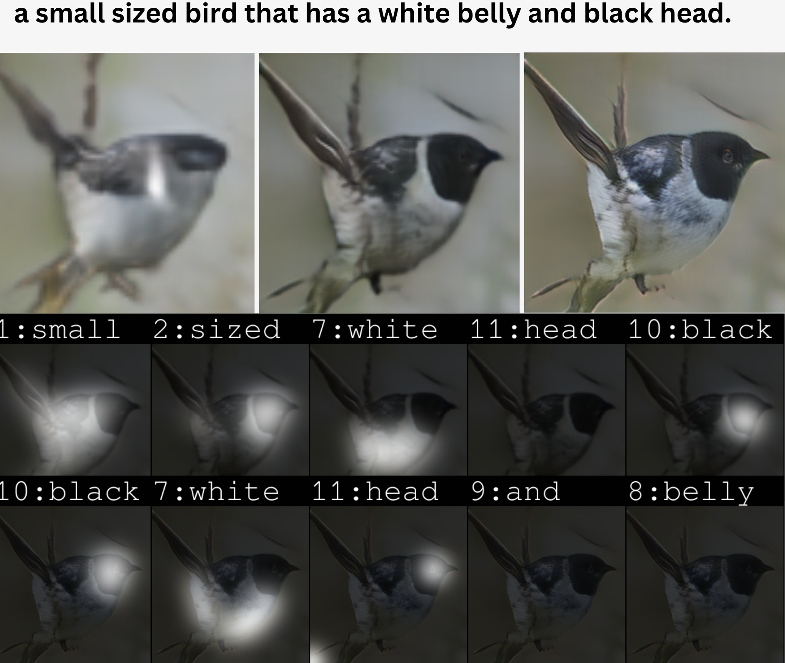
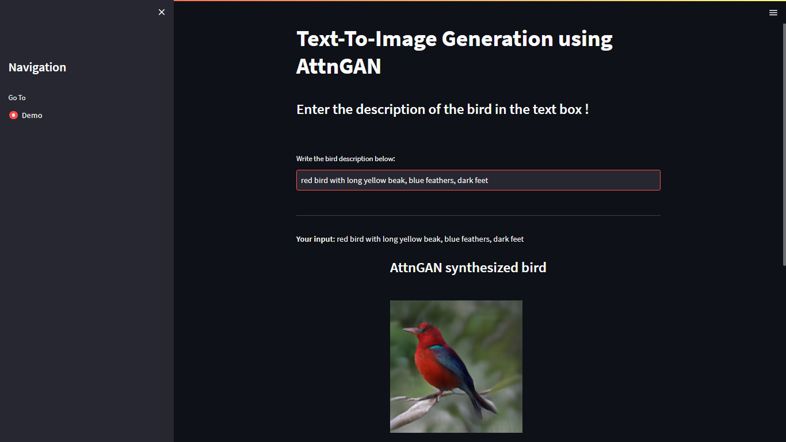
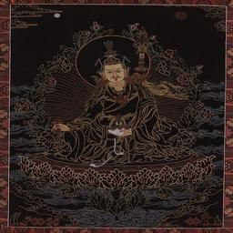
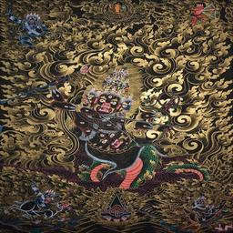
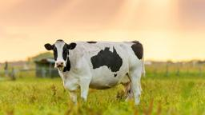
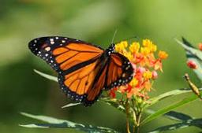
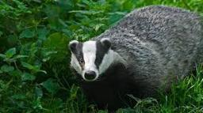

# AttnGAN

In this project, We have implemented AttnGAN using Pytorch. We have also made a streamlit web application. This project is heavily inspired from [AttnGAN: Fine-Grained Text to Image Generation with Attentional Generative Adversarial Networks](http://openaccess.thecvf.com/content_cvpr_2018/papers/Xu_AttnGAN_Fine-Grained_Text_CVPR_2018_paper.pdf) by Tao Xu, Pengchuan Zhang, Qiuyuan Huang, Han Zhang, Zhe Gan, Xiaolei Huang, Xiaodong He.

For the depth understanding of working mechanism of the AttnGAN model, you can watch following video:

### Dependencies
python 3.9

Pytorch 1.8.1 (download cpu version from https://download.pytorch.org/whl/torch_stable.html)

In addition, Please install dependencies using following command:
`pip install requirements.txt`. 

**Data**

1. Download our preprocessed metadata for [birds](https://drive.google.com/open?id=1O_LtUP9sch09QH3s_EBAgLEctBQ5JBSJ) and save them to `data/`
2. Download the [birds](https://data.caltech.edu/records/65de6-vp158) image data. Extract them to `data/birds/`

**Training**
- Pre-train DAMSM models:
  - For bird dataset: `python pretrain_DAMSM.py --cfg cfg/DAMSM/bird.yml --gpu 0`
 
- Train AttnGAN models:
  - For bird dataset: `python main.py --cfg cfg/bird_attn2.yml --gpu 2`

- `*.yml` files are example configuration files for training/evaluation our models.

**Pretrained Model**
- [DAMSM for bird](https://drive.google.com/drive/folders/1Wt2WDaf68UA1S4DCoObYivogemmcLrjr?usp=share_link). Download and save it to `DAMSMencoders/`
- [AttnGAN for bird](https://drive.google.com/drive/folders/1HOexooonWJECddfyZc_k7MFFUUGzTaob?usp=share_link). Download and save it to `models/`

**Examples generated by AttnGAN**

 bird example              | 
:-------------------------:|
  |  ![]

### Streamlit App
In this project, we have made streamlit app which you can run by following command:

`streamlit run app.py`

The Screenshot for the project is as follows:

We have also deployed the app over streamlit which you can run by using following link:
[Demo](https://anishmachamasi-attngan-text-to-image-generation-app-ubgrfm.streamlit.app/)

###Custom Dataset
In this project, We have created our own dataset for the project, namely:
1. Thanka Dataset
2. Animal Dataset

**Some Data Samples:**

1. Thanka Dataset 

  
  
  

Link for the Thanka Dataset:
[Thanka Dataset](https://drive.google.com/drive/folders/1sllSH_9mX2YzY7SCoDkdq7wyw1ww0DWq?usp=share_link)

2. Animal Dataset

  
  
  

**For link:** 
Please contact us.

**Procedure of making custom dataset**
Contact Us without any hesitation.

# Contact Us

If you have any questions or comments, please feel free to contact us at:

- Email: [anishmachamasi2262@gmail.com](mailto:nishmachamasi2262@gmail.com)

We look forward to hearing from you!

**Reference:**

- [AttnGAN: Fine-Grained Text to Image Generation with Attentional Generative Adversarial Networks](https://openaccess.thecvf.com/content_cvpr_2018/papers/Xu_AttnGAN_Fine-Grained_Text_CVPR_2018_paper.pdf) [[code]](https://github.com/taoxugit/AttnGAN)
